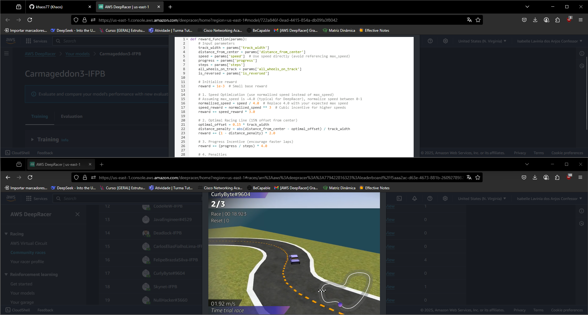

# Corrida da AWS
O AWS DeepRacer é uma competição desenvolvida pela Amazon Web Services que permite aos usuários explorar conceitos de machine learning, especialmente o aprendizado por reforço, de maneira prática e divertida. Utilizando um modelo 3D de simulação ou um carrinho físico autônomo, os participantes treinam algoritmos para percorrer pistas otimizando seu desempenho a cada tentativa. A plataforma é amplamente utilizada em competições, como a AWS DeepRacer League, incentivando o aprendizado de IA por meio de desafios reais.

Aprendizados adquiridos na competição
Participar do projeto foi desafiador e extremamente enriquecedor. Aprendi conceitos fundamentais da inteligência artificial, como entropia, aprendizado da máquina e ganho de informação, além de compreender a importância da calibragem das constantes e da adaptabilidade do modelo. Também desenvolvi estratégias para manter o carro dentro da pista, garantindo que ele não permanecesse mais de cinco segundos fora dela, o que exigiu testes, ajustes finos e uma visão crítica sobre o comportamento do agente treinado.

